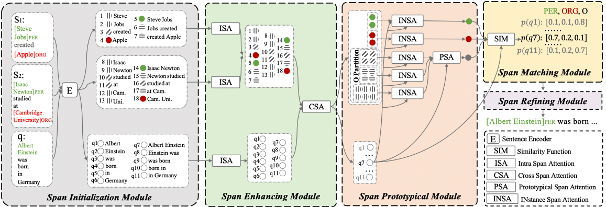

# ESD
Code For NAACL2022 Paper "[An Enhanced Span-based Decomposition Method for Few-Shot Sequence Labeling](https://arxiv.org/abs/2109.13023)"


# 🔥 Introduction
Few-Shot Sequence Labeling (FSSL) is a canonical paradigm for the tagging models, e.g., named entity recognition and slot filling, to generalize on an emerging, resource-scarce domain. Recently, the metric-based meta-learning framework has been recognized as a promising approach for FSSL. However, most prior works assign a label to each token based on the **token-level** similarities, which ignores the integrality of named entities or slots. To this end, in this paper, we propose ESD, an Enhanced Span-based Decomposition method for FSSL. ESD formulates FSSL as a **span-level** matching problem between test query and supporting instances.Specifically, ESD decomposes the span matching problem into a series of span-level procedures, mainly including **enhanced span representation**, **class prototype aggregation** and **span conflicts resolution**. Extensive experiments show that ESD achieves the new state-of-the-art results on two popular FSSL benchmarks, FewNERD and SNIPS, and is proven to be more robust in the nested and noisy tagging scenarios. 




# 🚀 How to use our code?
## 💾 Enviroment
```
pip install -r requirements.txt
```
We run our code on a single NVDIA A40 GPU, and we use `torch1.8.0+cu111`:
```
pip install torch==1.8.0+cu111 -f https://download.pytorch.org/whl/torch_stable.html
```

## 📚 Dataset
```
mkdir data
cd data
```
### FewNERD
We use the latest sampled dataset from [FewNERD](https://cloud.tsinghua.edu.cn/f/0e38bd108d7b49808cc4/?dl=1), which corresponds to the results of [the 6-th version FewNERD paper](https://arxiv.org/pdf/2105.07464v6.pdf).
The new sampled data fixs the data sampling bug, see [issue](https://github.com/thunlp/Few-NERD/issues/15).

```
wget -O data.zip https://cloud.tsinghua.edu.cn/f/0e38bd108d7b49808cc4/?dl=1
unzip data.zip
mv episode-data/* ./
rm -rf episide-data
```

### SNIPS
We use the sampled data from [SNIPS-FewShot](https://atmahou.github.io/attachments/ACL2020data.zip).

```
wget https://atmahou.github.io/attachments/ACL2020data.zip
unzip ACL2020data.zip
mv ACL2020data/* ./
rm -rf ACL2020data
cd ..
```


## 🏋🏻‍♂️ Train and Evaluation
```
mkdir checkpoint
mkdir results
```

Make sure your have the data file structure as follows:
```
├── bash
│   ├── fewnerd
│   └── snips
├── checkpoint
├── data
│   ├── inter
│   ├── intra
│   ├── xval_snips
│   └── xval_snips_shot_5
├── model
│   ├── ESD.py
│   └── utils.py
├── README.md
├── requirements.txt
├── results
├── train_demo.py
└── util
    ├── data_loader.py
    ├── framework.py
    └── utils.py
```


### FewNERD
```
bash bash/fewnerd/run_mode.sh [gpu_id] [mode] [N] [K]
    - mode: intra/inter
    - N, K: 5 1, 5 5, 10 1
    e.g., bash bash/fewnerd/run_mode.sh 0 inter 5 1
bash bash/fewnerd/10wat_5shot_mode.sh [gpu_id] [mode]
    - mode: intra/inter
    e.g., bash/fewnerd/10wat_5shot_mode.sh 0 inter
```
### SNIPS
```
bash bash/snips/1-shot/1_shot_mode_1.sh [gpu_id]
...
bash bash/snips/1-shot/1_shot_mode_7.sh [gpu_id]
```
```
bash bash/snips/5-shot/5_shot_mode_1.sh [gpu_id]
...
bash bash/snips/5-shot/5_shot_mode_7.sh [gpu_id]
```


# 🌝 Citation
If you use our code, plearse cite our paper:
```
@article{wang2021enhanced,
  title={An Enhanced Span-based Decomposition Method for Few-Shot Sequence Labeling},
  author={Wang, Peiyi and Xu, Runxin and Liu, Tianyu and Zhou, Qingyu and Cao, Yunbo and Chang, Baobao and Sui, Zhifang},
  journal={arXiv preprint arXiv:2109.13023},
  year={2021}
}
```
